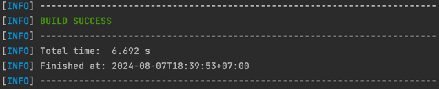
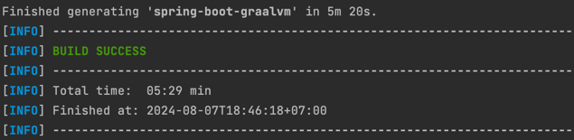
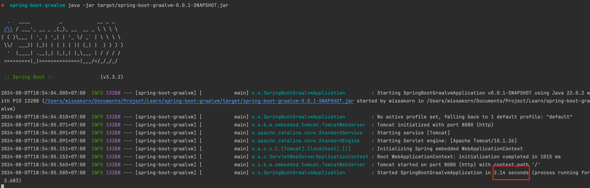
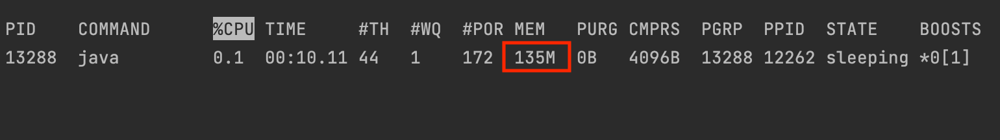
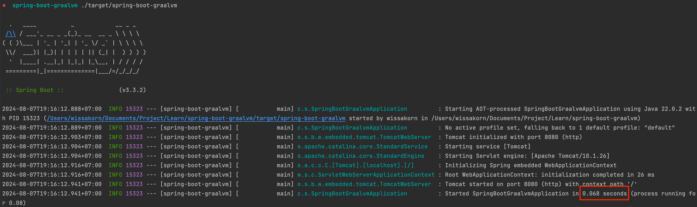
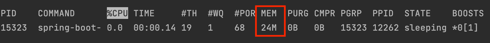

# Step to run
Install GraalVM https://www.graalvm.org/latest/docs/getting-started/macos/
```
➜  ~ java -version
java version "22.0.2" 2024-07-16
Java(TM) SE Runtime Environment Oracle GraalVM 22.0.2+9.1 (build 22.0.2+9-jvmci-b01)
Java HotSpot(TM) 64-Bit Server VM Oracle GraalVM 22.0.2+9.1 (build 22.0.2+9-jvmci-b01, mixed mode, sharing)

./mvnw clean package                            # pack jar
./mvnw -Pnative native:compile -DskipTests      # build native image

```
- Build jar time


  
- Build native time



# Test Run
### Run jar
```
java -jar target/spring-boot-graalvm-0.0.1-SNAPSHOT.jar

ps -ax | grep -i spring-boot-graalvm    # find PID
top -pid <PID>
```



## Run native
```
./target/spring-boot-graalvm

ps -ax | grep -i spring-boot-graalvm    # find PID
top -pid <PID>
```


